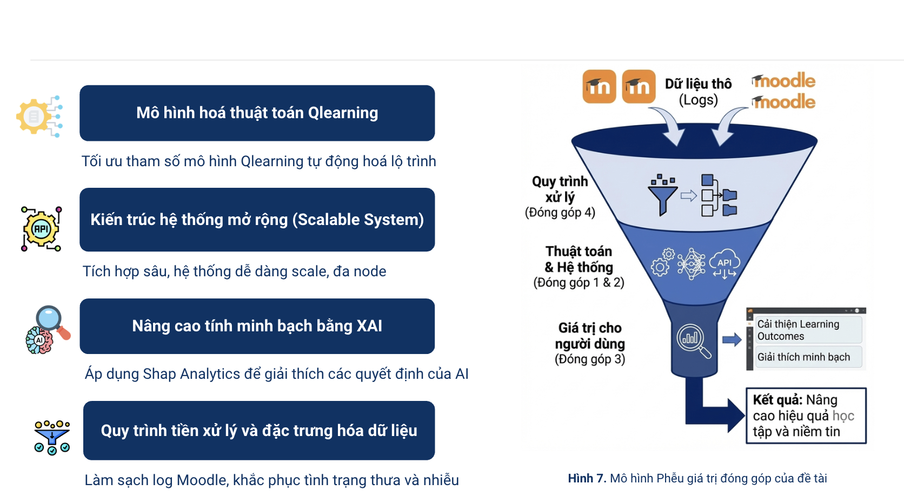
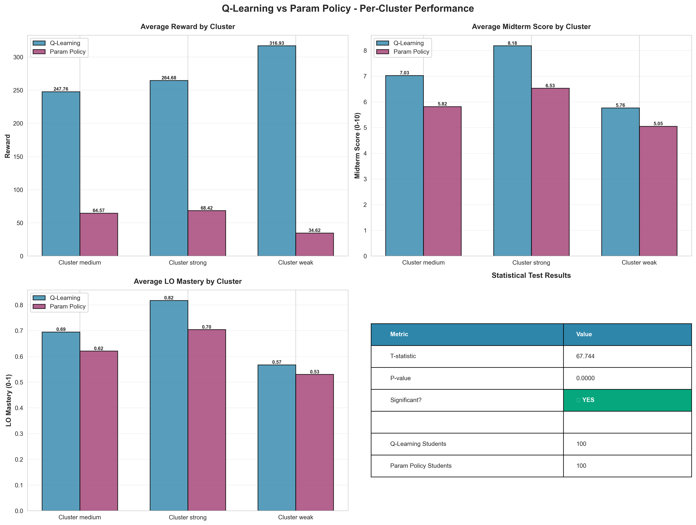

# Adaptive STEM Learning Pathway Optimization via Reinforcement Learning

> **Khung học tập thích ứng** dựa trên thuật toán **Q-learning**, được thiết kế để cá nhân hóa lộ trình học tập STEM cho sinh viên bằng cách tích hợp trực tiếp vào nền tảng **Moodle LMS** thông qua chuẩn **LTI 1.3**.

---

## Các đóng góp chính

---

## Phương pháp đề xuất

### Chi tiết phương pháp đề xuất

---

## Kết quả

