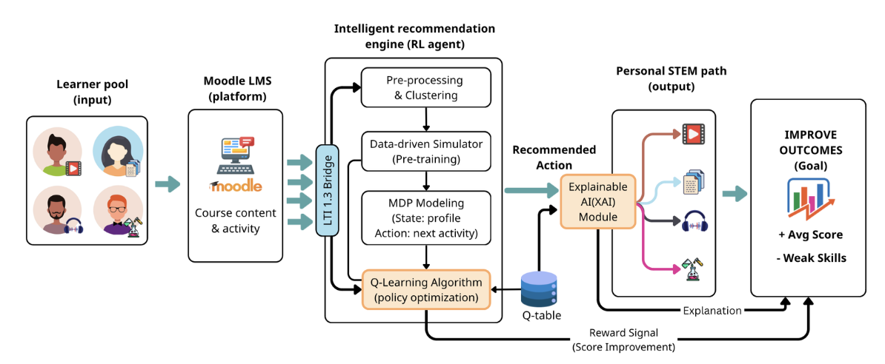
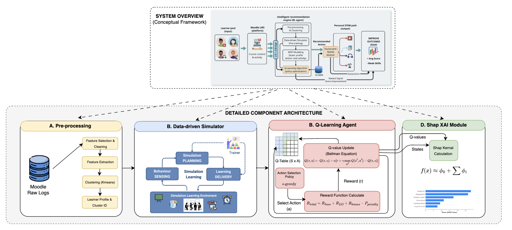
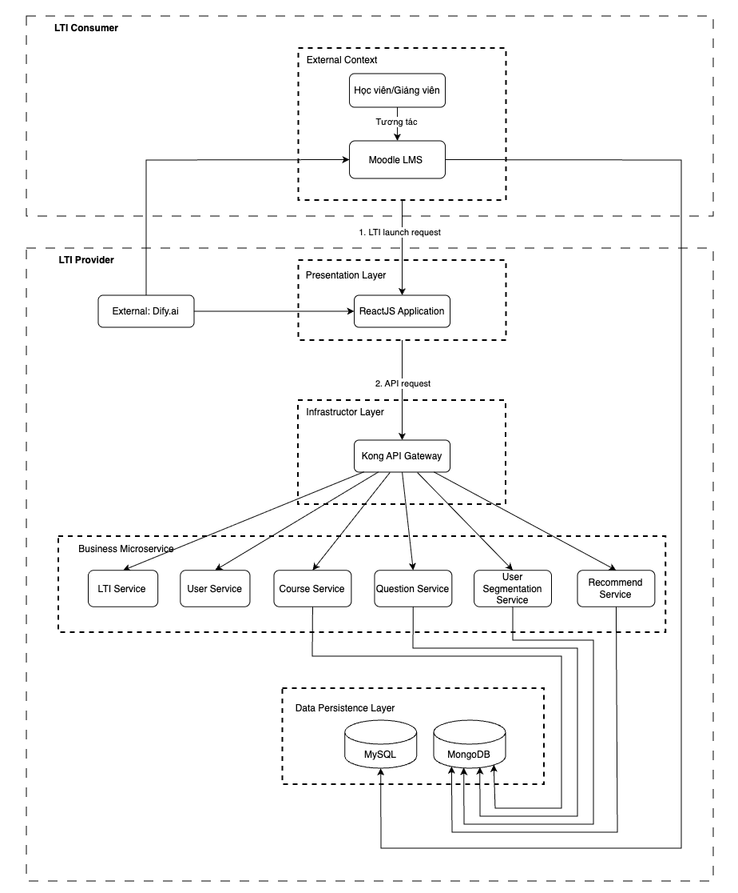

# 🎓 Adaptive STEM Learning Pathway Optimization

<div align="center">

**Personalized STEM Learning via Reinforcement Learning**

[](https://opensource.org/licenses/MIT)
[](https://www.python.org/downloads/)
[](https://docs.moodle.org/dev/LTI)
[](https://www.docker.com/)

**English** | [Tiếng Việt](README_VN.md)

</div>

---

## 👥 Project Information

**Authors:** Nguyen Huu Loc, Van Tuan Kiet

**Supervisor:** Dr. Do Nhu Tai

**Institution:** Faculty of Information Technology - Saigon University

---

## 📝 Abstract

In the context of Education 4.0, traditional Learning Management Systems (LMS) typically apply a uniform learning pathway for all learners, leading to ineffective personalization. This project proposes an **adaptive learning framework** based on **Q-learning** algorithm, integrated into the **Moodle** platform via **LTI 1.3** standard.

The learning process is modeled as a **Markov Decision Process (MDP)**, combined with **K-means** behavioral clustering to construct a multi-dimensional learner state space. Experimental results from 500 simulation episodes demonstrate that the system improves average scores by **22.5%** and reduces weak skills by up to **51.0%**.

**Keywords:** `Reinforcement Learning` • `Q-learning` • `Personalized Learning` • `STEM Education` • `Moodle LMS` • `Adaptive Learning`

## 📌 Table of Contents

- [👥 Project Information](#-project-information)
- [📝 Abstract](#-abstract)
- [🔍 Introduction](#-introduction)
- [🛠 Proposed Method](#-proposed-method)
- [📊 Experimental Results](#-experimental-results)
- [🏗️ System Architecture](#️-system-architecture)
- [💻 Installation](#-installation)
- [📚 References](#-references)
- [📄 License](#-license)
- [🤝 Contributing](#-contributing)
- [📞 Contact](#-contact)

---

## 🔍 Introduction

STEM education faces significant challenges due to **substantial differences** in students' abilities, foundational knowledge, and learning pace. Learning Management Systems (LMS) like Moodle typically function only as content repositories and grade trackers, **lacking behavioral analysis capabilities** and timely pedagogical intervention.

This project proposes an **adaptive learning framework** based on **Reinforcement Learning (Q-learning)** - enabling an AI Agent to autonomously explore and optimize teaching strategies through trial-and-error mechanisms, continuously adapting based on learner feedback.

---

## 🛠 Proposed Method

The system models the learning process as a **Markov Decision Process (MDP)** with three components: multi-dimensional state space (6 features), action space (15 pedagogical actions), and multi-objective reward function.



### 📈 Detailed Methodology



### 🔬 Key Technical Components

#### 1️⃣ State Space (S)

**6-dimensional** learner state representation:

| Dimension | Description | Values |
|-----------|-------------|--------|
| **Cluster** | Behavioral cluster (K-means) | 0-4 |
| **Module** | Current learning module | 1-N |
| **Progress** | Completion progress | 0.0-1.0 |
| **Score Level** | Performance level | 0-4 |
| **Phase** | Learning phase (Quiz/Forum/Assignment) | 0-2 |
| **Engagement** | Interaction level | 0-4 |

#### 2️⃣ Action Space (A)

**15 pedagogical actions** organized by temporal axis:

- **Past (Remedial):** Review weak Learning Outcomes (LO)
- **Present (Standard):** Follow standard learning pathway
- **Future (Advanced):** Preview advanced content

#### 3️⃣ Reward Function (R)

$$R_{total} = R_{base} + R_{LO} + R_{bonus} - P_{penalty}$$

Where:
- $R_{base}$: Base reward from score performance
- $R_{LO}$: Reward for improving weak skills
- $R_{bonus}$: Bonus for active engagement
- $P_{penalty}$: Penalty for inappropriate actions

### 📈 Q-learning Algorithm Details

The Q-learning algorithm uses **Bellman update rule** with epsilon-greedy strategy for exploration-exploitation balance:

$$Q(s,a) \leftarrow Q(s,a) + \alpha[r + \gamma \max_{a'} Q(s',a') - Q(s,a)]$$

Where: $\alpha$ = learning rate (0.1), $\gamma$ = discount factor (0.95)

### 🔍 Explainable AI (XAI) - SHAP Framework

To interpret Agent decisions, the system integrates **SHAP (SHapley Additive exPlanations)** - measuring each state feature's contribution to action selection:

$$\phi_i(s) = \sum_{S \subseteq F \setminus \{i\}} \frac{|S|!(|F|-|S|-1)!}{|F|!}[f(S \cup \{i\}) - f(S)]$$

This helps educators understand **why** the system recommends specific actions for each student.

---

## 📊 Experimental Results

### ⚙️ Experimental Setup

- **Scale:** 500 episodes × 100 virtual students = **50,000 interaction trajectories**
- **Dataset:** Moodle Log & Grades - Course ID 670 (public dataset)
- **Baseline:** Param Policy (historical behavior simulation)
- **Learner modeling:** 70% Linear learners, 20% Video-first, 10% Practice-first

### 📈 Q-table Training Process


*Figure: Q-learning convergence over 500 episodes*

### 📊 Performance Comparison

| Metric | Param Policy (Baseline) | Q-learning (Ours) | Improvement |
|--------|------------------------|-------------------|-------------|
| **Average Score** (scale 0-10) | 5.82 ± 0.48 | 7.14 ± 0.82 | ⬆️ **+22.5%** |
| **Weak Skills Count** | 3.02 | 1.48 | ⬇️ **-51.0%** |
| **Average Reward** | 59.95 ± 12.38 | 264.26 ± 27.33 | ⬆️ **+340.8%** |

> 💡 **Conclusion:** Q-learning significantly outperforms Param Policy across all metrics, demonstrating its capability to optimize personalized learning pathways.

### 🔍 Explainability Analysis


*Figure: SHAP values reveal that **Cluster** and **Score Level** are the two most important features in the Agent's decision-making process.*

---

## 🏗️ System Architecture

### 📦 Microservices Overview



```
moodle-adaptive-learning-plugin/
├── user-segmentation-service/   # Student behavioral clustering (K-means)
├── course-service/              # Course and content management
├── user-service/                # User information management
├── question-service/            # Question bank management
├── recommend-service/           # Learning recommendation (Q-learning Agent)
├── lti-service-python/          # LTI 1.3 Authentication & Integration
├── FE-service-v3/               # Frontend React + TypeScript
└── kong-gateway/                # API Gateway & Load Balancer
```

---

## 💻 Installation

### 📋 System Requirements

- **Docker & Docker Compose:** 20.10+
- **Moodle:** 4.5+ with LTI 1.3 enabled

### 🚀 Docker Deployment

```bash
# Clone repository
git clone https://github.com/kltn-moolde/moodle-adaptive-learning-plugin.git
cd moodle-adaptive-learning-plugin

# Launch entire system
docker compose --env-file .env.production -f docker-compose.prod.yml up -d --pull always --build
```

The system will automatically:
- ✅ Build all microservices
- ✅ Initialize database
- ✅ Configure API Gateway (Kong)
- ✅ Deploy frontend React app

---

## 📚 References

[1] M. T. Chi and R. Wylie, "The ICAP framework: Linking cognitive engagement to active learning outcomes," *Educational Psychologist*, 2014.

[2] R. S. Sutton and A. G. Barto, *Reinforcement learning: An introduction*, MIT Press, 1998.

[3] S. M. Lundberg and S.-I. Lee, "A unified approach to interpreting model predictions," *Advances in Neural Information Processing Systems*, 2017.

[4] IMS Global Learning Consortium, "LTI 1.3 Core Specification," 2019. [Online]. Available: https://www.imsglobal.org/spec/lti/v1p3/

[5] Moodle Documentation, "LTI and Moodle," 2023. [Online]. Available: https://docs.moodle.org/

---

## 📄 License

This system is released under the **MIT License**.

```
MIT License

Copyright (c) 2026 Nguyen Huu Loc, Van Tuan Kiet

Permission is hereby granted, free of charge, to any person obtaining a copy
of this software and associated documentation files (the "Software"), to deal
in the Software without restriction...
```

See [LICENSE](LICENSE) for details.

---

## 🤝 Contributing

We welcome contributions to this project!

### 🔧 How to Contribute

1. Fork the repository
2. Create a new branch (`git checkout -b feature/AmazingFeature`)
3. Commit your changes (`git commit -m 'Add some AmazingFeature'`)
4. Push to the branch (`git push origin feature/AmazingFeature`)
5. Open a Pull Request

### 📝 Coding Standards

- Python: Follow PEP 8
- JavaScript/TypeScript: Use ESLint + Prettier
- Commit messages: Conventional Commits format

---

## 📞 Contact

**Research Team:**
- 📧 Email: [lockbkbang@gmail.com](mailto:lockbkbang@gmail.com)
- 📱 GitHub Issues: [Report bugs](https://github.com/kltn-moolde/moodle-adaptive-learning-plugin/issues)

---

## 🙏 Acknowledgments

This project was conducted with support from:
- Faculty of Information Technology - Saigon University
- Dr. Do Nhu Tai (Supervisor)

---

<div align="center">

**⭐ If you find this project useful, please give us a star! ⭐**

Made with ❤️ by Adaptive Learning Team

</div>